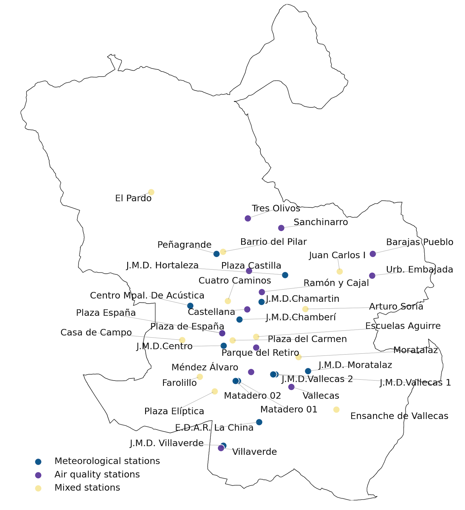
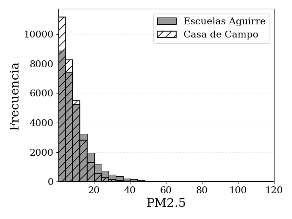
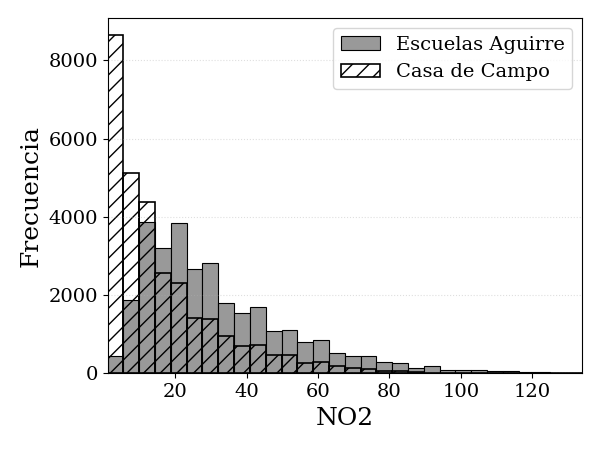
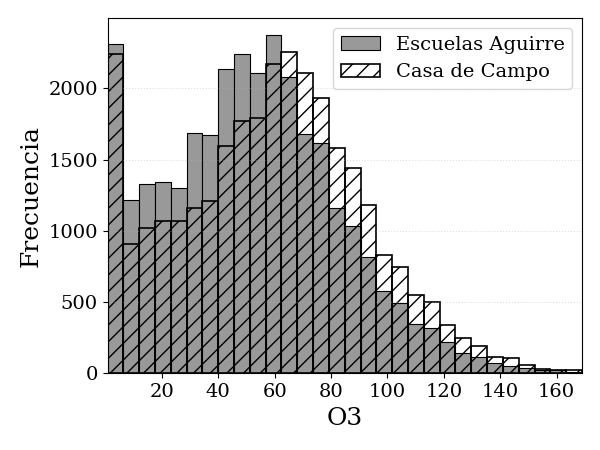
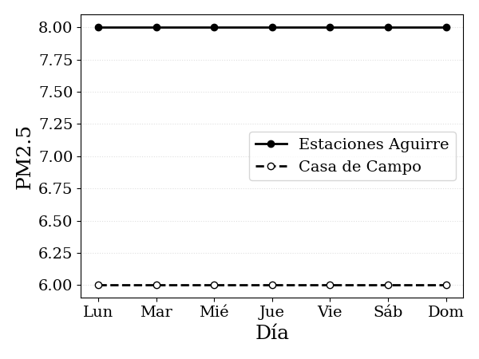
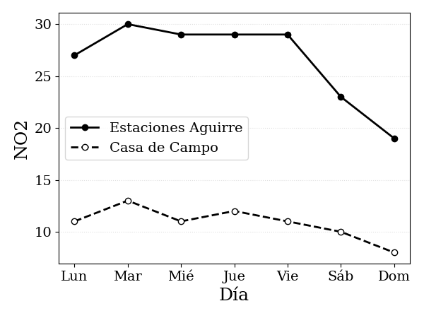
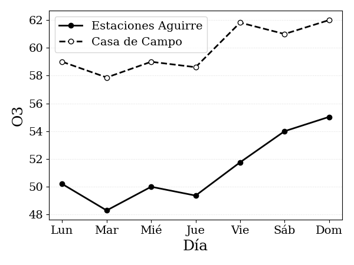

# Análisis de los datos

En este capítulo se resume el procedimiento de análisis y preparación de los datos utilizados para la experimentación y validación de los modelos de redes neuronales.

## Selección de los datos

La fase de selección identifica y extrae las fuentes de información que se utilizan en todo el análisis posterior.

El modelo de predicción usa datos de la ciudad de Madrid provenientes de informes horarios generados por el Sistema Integral de la Calidad del Aire del Ayuntamiento de Madrid, accesibles a través de su Portal de Datos Abiertos. Se dispone de un total de 37 estaciones que miden todos o una combinación de concentraciones de ozono (O3), dióxido de azufre (SO2), monóxido de carbono (CO), dióxido de nitrógeno (NO2), óxido nítrico (NO), partículas en suspensión de tamaño menor a 10 &micro;m (PM10) y partículas en suspensión de tamaño menor a 2,5 &micro;m (PM2.5), además de variables meteorológicas, incluyendo radiación ultravioleta, velocidad del viento, dirección del viento, temperatura, humedad relativa, presión barométrica, radiación solar y precipitación. Las estaciones que miden contaminantes son clasificadas por el Ayuntamiento de Madrid según su entorno, como se resume en . Esta clasificación define tres tipos: urbana de tráfico, junto a vías de alta intensidad; urbana de fondo, ubicadas lejos de focos directos para representar la exposición media; y suburbana, situadas en la periferia.

*Figura: Distribución geográfica de las estaciones de monitoreo del Ayuntamiento de Madrid (datos de datos.madrid.es).*

<figure class="thesis-table" id="tbl-estaciones-clasificacion">
  <table class="thesis-table__table">
    <thead>
      <tr class="header-row">
        <th>Estación</th>
        <th>Tipo</th>
      </tr>
    </thead>
    <tbody>
      <tr><td>Plaza de España</td><td>Urbana tráfico</td></tr>
      <tr><td>Escuelas Aguirre</td><td>Urbana tráfico</td></tr>
      <tr><td>Ramón y Cajal</td><td>Urbana tráfico</td></tr>
      <tr><td>Arturo Soria</td><td>Urbana fondo</td></tr>
      <tr><td>Villaverde</td><td>Urbana fondo</td></tr>
      <tr><td>Farolillo</td><td>Urbana fondo</td></tr>
      <tr><td>Casa de Campo</td><td>Suburbana</td></tr>
      <tr><td>Barajas Pueblo</td><td>Urbana fondo</td></tr>
      <tr><td>Plaza del Carmen</td><td>Urbana fondo</td></tr>
      <tr><td>Moratalaz</td><td>Urbana tráfico</td></tr>
      <tr><td>Cuatro Caminos</td><td>Urbana tráfico</td></tr>
      <tr><td>Barrio del Pilar</td><td>Urbana tráfico</td></tr>
      <tr><td>Vallecas</td><td>Urbana fondo</td></tr>
      <tr><td>Méndez Álvaro</td><td>Urbana fondo</td></tr>
      <tr><td>Castellana</td><td>Urbana tráfico</td></tr>
      <tr><td>Parque del Retiro</td><td>Urbana fondo</td></tr>
      <tr><td>Plaza Castilla</td><td>Urbana tráfico</td></tr>
      <tr><td>Ensanche de Vallecas</td><td>Urbana fondo</td></tr>
      <tr><td>Urb. Embajada</td><td>Urbana fondo</td></tr>
      <tr><td>Plaza Elíptica</td><td>Urbana tráfico</td></tr>
      <tr><td>Sanchinarro</td><td>Urbana fondo</td></tr>
      <tr><td>El Pardo</td><td>Suburbana</td></tr>
      <tr><td>Juan Carlos I</td><td>Suburbana</td></tr>
      <tr><td>Tres Olivos</td><td>Urbana fondo</td></tr>
    </tbody>
  </table>
  <figcaption>Clasificación de las estaciones según su entorno.</figcaption>
</figure>

Entre todas las mediciones, en este estudio se seleccionaron como variables objetivo aquellos contaminantes que tienen establecidos umbrales por el Ministerio para la Transición Ecológica y el Reto Demográfico (MITECO) y que, además, presentan una gran relevancia sanitaria según la Agencia Europea de Medio Ambiente (AEE). En consecuencia, se priorizaron PM2.5, NO2 y O3. A escala global, estos tres contaminantes constituyen los principales compuestos con mayor impacto sanitario. Según el informe de 2024 de la AEE, en 2022 fueron responsables de aproximadamente 239.000 muertes prematuras por PM2.5, 70.000 por O3 y 48.000 por NO2 en la Unión Europea.

En contraste, CO y SO2, que tienen escasa incidencia en la mortalidad, se excluyeron del análisis para profundizar en el estudio de los contaminantes seleccionados. Para el caso de PM10, este aporta información muy similar a PM2.5, ya que PM2.5 constituye una fracción de PM10.

El conjunto de datos empleado abarca del 1 de julio de 2021 al 31 de diciembre de 2024. Durante la pandemia de COVID-19 se decretaron dos estados de alarma, el primero del 15 de marzo al 21 de junio de 2020 y el segundo del 25 de octubre de 2020 al 9 de mayo de 2021, en los que se impusieron confinamientos, toques de queda y cierres de actividades industriales y de movilidad. Estas medidas provocaron reducciones de contaminación a niveles atípicos para la ciudad de Madrid, generando rupturas en la tendencia y la estacionalidad de las series temporales. Por esta razón se optó por excluir esos episodios para preservar la homogeneidad y validez de los modelos predictivos.

Los valores estadísticos de los contaminantes seleccionados se muestran en . La media y la desviación estándar se calcularon a partir de la unión de los datos de todo el período de evaluación. Para el mínimo y máximo se toma el valor de cada año y luego se calcula la media para evitar la influencia de valores extremos puntuales. Además, se consideran valores mayores a 0, ya que los negativos no son físicamente posibles, y se excluyen los iguales a 0 por reflejar ausencia de señal fiable en un entorno urbano.

<figure class="thesis-table" id="tbl-resumen-contaminantes">
  <table class="thesis-table__table">
    <thead>
      <tr class="header-row">
        <th>Contaminante</th>
        <th>Unidad</th>
        <th># estaciones</th>
        <th>Media</th>
        <th>Desviación estándar</th>
        <th>Mínimo</th>
        <th>Máximo</th>
      </tr>
    </thead>
    <tbody>
      <tr>
        <td>PM2.5</td>
        <td>&micro;g/m3</td>
        <td>8</td>
        <td>9.77</td>
        <td>8.98</td>
        <td>1.00</td>
        <td>177.30</td>
      </tr>
      <tr>
        <td>NO2</td>
        <td>&micro;g/m3</td>
        <td>24</td>
        <td>26.92</td>
        <td>19.31</td>
        <td>2.08</td>
        <td>133.50</td>
      </tr>
      <tr>
        <td>O3</td>
        <td>&micro;g/m3</td>
        <td>13</td>
        <td>54.37</td>
        <td>31.93</td>
        <td>1.52</td>
        <td>180.51</td>
      </tr>
    </tbody>
  </table>
  <figcaption>Estadísticos descriptivos de los contaminantes seleccionados.</figcaption>
</figure>

Los valores estadísticos desagregados por estación se muestran en , aplicando el mismo criterio de filtrado. Esta tabla permite observar la variabilidad espacial de los contaminantes según la estación de medición y su clasificación.

<figure class="thesis-table" id="tbl-resumen-estaciones">
  <table class="thesis-table__table">
    <thead>
      <tr class="group-row">
        <th rowspan="2">#e</th>
        <th colspan="2" class="group-head">NO2</th>
        <th colspan="2" class="group-head">PM2.5</th>
        <th colspan="2" class="group-head">O3</th>
      </tr>
      <tr class="header-row">
        <th>&mu; &plusmn; &sigma;</th>
        <th>Min-Max</th>
        <th>&mu; &plusmn; &sigma;</th>
        <th>Min-Max</th>
        <th>&mu; &plusmn; &sigma;</th>
        <th>Min-Max</th>
      </tr>
    </thead>
    <tbody>
      <tr><td>4</td><td>26.0 &plusmn; 19.8</td><td>1.0-157.0</td><td>--</td><td>--</td><td>--</td><td>--</td></tr>
      <tr><td>8</td><td>32.4 &plusmn; 22.0</td><td>1.0-179.5</td><td>11.36 &plusmn; 35.7</td><td>1.0-440.5</td><td>52.0 &plusmn; 31.03</td><td>0.9-336.6</td></tr>
      <tr><td>11</td><td>29.9 &plusmn; 24.5</td><td>1.5-196.5</td><td>--</td><td>--</td><td>--</td><td>--</td></tr>
      <tr><td>16</td><td>26.0 &plusmn; 21.7</td><td>1.0-168.5</td><td>--</td><td>--</td><td>53.1 &plusmn; 32.6</td><td>1.0-234.5</td></tr>
      <tr><td>17</td><td>34.3 &plusmn; 28.0</td><td>1.0-195.0</td><td>--</td><td>--</td><td>51.3 &plusmn; 35.0</td><td>1.0-213.5</td></tr>
      <tr><td>18</td><td>27.5 &plusmn; 21.4</td><td>1.0-171.0</td><td>--</td><td>--</td><td>52.3 &plusmn; 34.2</td><td>0.9-261.9</td></tr>
      <tr><td>24</td><td>16.5 &plusmn; 16.0</td><td>1.0-134.0</td><td>7.8 &plusmn; 6.9</td><td>1.00-81.0</td><td>59.0 &plusmn; 33.4</td><td>0.9-255.0</td></tr>
      <tr><td>27</td><td>30.8 &plusmn; 23.4</td><td>1.0-152.0</td><td>--</td><td>--</td><td>51.0 &plusmn; 36.1</td><td>0.9-245.6</td></tr>
      <tr><td>35</td><td>30.0 &plusmn; 19.8</td><td>1.5-150.5</td><td>--</td><td>--</td><td>55.6 &plusmn; 33.3</td><td>1.0-219.0</td></tr>
      <tr><td>36</td><td>28.6 &plusmn; 21.7</td><td>1.0-150.5</td><td>--</td><td>--</td><td>--</td><td>--</td></tr>
      <tr><td>38</td><td>28.0 &plusmn; 23.6</td><td>1.0-185.5</td><td>9.9 &plusmn; 10.2</td><td>1.0-130.5</td><td>--</td><td>--</td></tr>
      <tr><td>39</td><td>27.7 &plusmn; 24.7</td><td>1.0-191.5</td><td>--</td><td>--</td><td>55.7 &plusmn; 34.2</td><td>1.0-210.5</td></tr>
      <tr><td>40</td><td>29.0 &plusmn; 23.2</td><td>1.5-148.5</td><td>--</td><td>--</td><td>--</td><td>--</td></tr>
      <tr><td>47</td><td>26.2 &plusmn; 22.4</td><td>1.0-168.0</td><td>9.6 &plusmn; 20.2</td><td>1.0-281.5</td><td>--</td><td>--</td></tr>
      <tr><td>48</td><td>26.6 &plusmn; 20.5</td><td>1.0-170.5</td><td>10.1 &plusmn; 13.7</td><td>1.0-517.0</td><td>--</td><td>--</td></tr>
      <tr><td>49</td><td>19.9 &plusmn; 17.0</td><td>1.0-129.0</td><td>--</td><td>--</td><td>53.5 &plusmn; 32.8</td><td>1.0-410.8</td></tr>
      <tr><td>50</td><td>30.2 &plusmn; 20.6</td><td>1.5-190.0</td><td>9.4 &plusmn; 14.9</td><td>1.0-492.5</td><td>--</td><td>--</td></tr>
      <tr><td>54</td><td>28.9 &plusmn; 26.1</td><td>1.0-251.5</td><td>--</td><td>--</td><td>52.1 &plusmn; 32.9</td><td>0.9-178.1</td></tr>
      <tr><td>55</td><td>27.4 &plusmn; 22.9</td><td>1.0-169.0</td><td>--</td><td>--</td><td>--</td><td>--</td></tr>
      <tr><td>56</td><td>36.8 &plusmn; 25.1</td><td>1.0-186.5</td><td>11.5 &plusmn; 17.7</td><td>1.0-809.0</td><td>--</td><td>--</td></tr>
      <tr><td>57</td><td>23.8 &plusmn; 22.3</td><td>1.5-169.0</td><td>8.1 &plusmn; 6.5</td><td>1.0-65.0</td><td>--</td><td>--</td></tr>
      <tr><td>58</td><td>13.4 &plusmn; 11.1</td><td>1.0-162.0</td><td>--</td><td>--</td><td>56.9 &plusmn; 35.9</td><td>1.0-255.7</td></tr>
      <tr><td>59</td><td>21.4 &plusmn; 19.8</td><td>1.0-140.5</td><td>--</td><td>--</td><td>58.0 &plusmn; 33.6</td><td>1.0-214.5</td></tr>
      <tr><td>60</td><td>23.3 &plusmn; 18.9</td><td>1.0-150.5</td><td>--</td><td>--</td><td>58.0 &plusmn; 32.2</td><td>1.0-215.5</td></tr>
    </tbody>
  </table>
  <figcaption>Estadísticos descriptivos por estación (#e) para los contaminantes medidos.</figcaption>
</figure>

En los histogramas de cada contaminante se puede visualizar la distribución de una estación urbana de tráfico (Escuelas Aguirre) y una suburbana (Casa de Campo). Las gráficas se construyeron con 30 bins y filtrando los valores mayores o iguales a cero. Para esta etapa del análisis, el eje x se limitó al percentil 99.9 de la distribución combinada de cada contaminante, evitando que los valores atípicos puntuales distorsionen la escala sin afectar la interpretación del grueso de los datos. Se eligieron estas dos estaciones porque miden simultáneamente los contaminantes objetivo y representan dos categorías distintas del sistema de monitoreo.

En los tres histogramas se observa una asimetría positiva: una gran concentración de observaciones moderadas y una cola hacia la derecha generada por pocos episodios extremos. En PM2.5, la estación suburbana concentra más observaciones en rangos bajos y la frecuencia cae rápidamente al aumentar los valores, mientras que la estación de tráfico se desplaza hacia valores más altos y presenta una cola más pesada. Para NO2, la distribución de tráfico está claramente desplazada hacia la derecha y presenta una cola más pesada que la suburbana, lo cual es coherente con la influencia del tránsito. En el caso de O3, el comportamiento se invierte: la estación suburbana presenta niveles más altos en casi todo el rango y una cola mayor. El ozono troposférico suele alcanzar concentraciones más elevadas en áreas suburbanas y rurales que en los núcleos urbanos con mayor intensidad de tráfico, donde el NO emitido tiende a consumir O3 y reducir sus niveles locales.

*Figura: Histogramas de los contaminantes objetivo.*

Además de analizar la distribución de los contaminantes objetivo, se estudió el comportamiento semanal de sus concentraciones. En las gráficas correspondientes se presentan las concentraciones para la misma estación urbana de tráfico (Escuelas Aguirre) y suburbana (Casa de Campo), comparando las formas de distribución. Para cada estación y contaminante se calcula la mediana diaria sobre todos los años del conjunto de datos, obteniendo un valor representativo para cada día de la semana.

En el caso de NO2 se observa un patrón claramente definido. En ambas estaciones, las concentraciones durante los días laborales presentan valores más elevados que los registrados el fin de semana, con un descenso sostenido a partir del sábado y mínimos el domingo. Esta dinámica refleja la influencia del tráfico. Para PM2.5, las variaciones semanales son casi constantes a lo largo de la semana, sugiriendo dependencia de factores menos cíclicos que el tránsito. En términos relativos, la estación urbana de tráfico presenta valores superiores a la suburbana. Para O3, la relación se invierte: las concentraciones son mayores en la estación suburbana y tienden a incrementarse hacia el fin de semana, alcanzando su pico el domingo.

*Figura: Patrones semanales de los contaminantes objetivo.*

## Preprocesamiento de los datos

En este capítulo también se resume la limpieza y el preprocesamiento del conjunto de datos, incluyendo integración de fuentes, manejo de valores atípicos y tratamiento de valores faltantes.

### Integración de los datos

En este proyecto se combinan dos tipos de registros provenientes del Portal de Datos Abiertos del Ayuntamiento de Madrid: contaminantes atmosféricos y variables meteorológicas. Ambos conjuntos están medidos con frecuencia horaria y clasificados por estación de monitoreo.

Los archivos de entrada aparecen en formatos CSV, TXT, XML y JSON. Se elige CSV por su apertura e interoperabilidad, además de su compatibilidad con distintas herramientas de aprendizaje automático. A diferencia de estructuras de datos jerárquicas, evita sobrecarga de metadatos y resulta adecuado para trabajar con gran cantidad de registros.

Cada archivo está estructurado de manera mensual y contiene metadatos como municipio, código de estación, provincia, magnitud, punto de muestreo, año, mes, día y campos horarios (H01-H24), además de una columna de validación para cada hora. Inicialmente se eliminan los campos de provincia, municipio y punto de muestreo, ya que el código de estación es suficiente para identificar cada serie. Luego se reorganiza el conjunto de datos de un formato ancho a uno largo, homogenizando nombres de columnas y mapeando los códigos de contaminantes o variables meteorológicas a etiquetas descriptivas.

Se genera una marca temporal completa con formato YYYY-MM-DD HH:MM, utilizada como índice temporal. Esta marca permite reconfigurar los datos en una tabla pivote donde cada fila representa una observación única por estación y hora, y cada columna corresponde a una variable medida.

Los subconjuntos de contaminantes y meteorología se fusionan por código de estación y marca temporal mediante una unión externa, preservando la información incluso cuando alguna de las dos fuentes presenta datos faltantes. El resultado es una estructura integrada por estación, implementada como una colección indexada por identificador, donde los valores son tablas indexadas por tiempo que combinan concentraciones de contaminantes y condiciones meteorológicas. Para cada estación se recuperan además las coordenadas geográficas de latitud y longitud a partir de catálogos auxiliares del portal, lo que habilita el análisis espacio-temporal posterior.

### Detección y manejo de valores atípicos

Las observaciones que se alejan significativamente del comportamiento general de los datos, así como aquellas físicamente imposibles, son detectadas y tratadas para evitar que distorsionen a los modelos predictivos.

En esta etapa no se realiza un análisis global, porque las contribuciones de estaciones ubicadas en zonas de baja polución no quedarían apropiadamente representadas en el proceso de entrenamiento. En su lugar, la detección de valores atípicos se realiza de forma local.

Inicialmente se establecen umbrales físicos plausibles para contaminantes y variables meteorológicas. Los mínimos y máximos definidos se resumen en . En el caso de las variables meteorológicas, la temperatura se fija en un rango de plausibilidad más amplio que los valores históricos registrados en Madrid, evitando eliminar posibles extremos futuros o errores de calibración. La humedad relativa se acota al rango 0-100, la presión barométrica se limita a 850-1050 hPa, la velocidad del viento a 0-60 m/s y tanto la radiación solar como la precipitación se restringen con umbrales suficientemente amplios como para cubrir episodios máximos documentados.

Para los contaminantes atmosféricos se fija un valor mínimo de 0, ya que no pueden existir mediciones negativas, y máximos antierror suficientemente altos para permitir picos extremos físicamente posibles pero evitar errores de sensor o unidades mal registradas. Todos los valores fuera de rango se establecen como NaN para ser tratados posteriormente en la etapa de valores faltantes.

<figure class="thesis-table" id="tbl-valores-fisicos">
  <table class="thesis-table__table">
    <thead>
      <tr class="header-row">
        <th>Variable</th>
        <th>Unidad</th>
        <th>Mínimo</th>
        <th>Máximo</th>
      </tr>
    </thead>
    <tbody>
      <tr><td>CO</td><td>mg/m3</td><td>0</td><td>50</td></tr>
      <tr><td>PM10</td><td>&micro;g/m3</td><td>0</td><td>3000</td></tr>
      <tr><td>PM2.5</td><td>&micro;g/m3</td><td>0</td><td>2000</td></tr>
      <tr><td>SO2</td><td>&micro;g/m3</td><td>0</td><td>2000</td></tr>
      <tr><td>NO2</td><td>&micro;g/m3</td><td>0</td><td>2000</td></tr>
      <tr><td>O3</td><td>&micro;g/m3</td><td>0</td><td>1000</td></tr>
      <tr><td>Radiación UV</td><td>índice</td><td>0</td><td>12+</td></tr>
      <tr><td>Velocidad del viento</td><td>m/s</td><td>0</td><td>60</td></tr>
      <tr><td>Dirección del viento</td><td>grados</td><td>0</td><td>360</td></tr>
      <tr><td>Temperatura</td><td>&deg;C</td><td>-20</td><td>50</td></tr>
      <tr><td>Humedad relativa</td><td>%</td><td>0</td><td>100</td></tr>
      <tr><td>Presión barométrica</td><td>hPa</td><td>850</td><td>1050</td></tr>
      <tr><td>Radiación solar</td><td>W/m2</td><td>0</td><td>1200</td></tr>
      <tr><td>Precipitación</td><td>mm/h</td><td>0</td><td>300</td></tr>
    </tbody>
  </table>
  <figcaption>Rangos físicos plausibles para cada variable según literatura y normativa.</figcaption>
</figure>

### Valores faltantes

Para que los modelos de redes neuronales funcionen correctamente se requiere un conjunto de datos de entrada sin datos incompletos. La presencia de valores faltantes impide realizar adecuadamente las operaciones matemáticas inherentes a la propagación y retropropagación, afectando la convergencia del modelo.

Previo a la imputación, se cuantifica el porcentaje de valores faltantes de los contaminantes por estación tras una reindexación a malla horaria.

La eliminación de registros incompletos reduciría el tamaño de la muestra e introduciría sesgos si los datos no fueran completamente aleatorios. Del mismo modo, usar media o mediana para completar valores faltantes tiende a distorsionar la varianza, las correlaciones entre variables y la variabilidad de la serie.

Cuando el porcentaje de valores faltantes supera el 40 %, se descarta el par estación-contaminante si se trata de una variable objetivo y, si es una variable de entrada, se elimina únicamente esa columna. Para el resto de los casos se diferencia según la duración de los huecos. Cuando los huecos son de hasta 3 horas continuas, se adopta la interpolación lineal sobre el eje temporal, preservando la estructura local de la serie. Para huecos mayores, que en la práctica resultan ser todos de al menos 24 horas, se incorporan máscaras explícitas para que el modelo identifique la ausencia de datos.

Se reindexa cada serie a una malla horaria y se construyen tres señales por variable: (i) xtimp, una imputación mínima usada únicamente para completar la forma del tensor, rellenada con 0 luego de normalizar la serie; (ii) mt, una máscara binaria que vale 1 cuando hay medición y 0 cuando falta; y (iii) &Delta;t, el tiempo transcurrido desde la última observación válida en horas. Estas señales se alimentan conjuntamente a los modelos, permitiendo modular la confianza en xtimp cuando mt = 0 y &Delta;t es grande. Además, toda imputación y normalización se realiza dentro de cada partición de entrenamiento y validación para evitar fuga de información.

## Transformación de los datos

En esta etapa se preparan y transforman los datos para adecuarlos al entrenamiento, aplicando operaciones de limpieza, normalización y reorganización de las series temporales.

### Winsorización

En primer lugar se realiza una winsorización local por cuantiles: para cada par estación-contaminante, los datos se limitan al intervalo [Q&alpha;, Q1-&alpha;] con Q&alpha; y Q1-&alpha; estimados únicamente en el conjunto de entrenamiento. En este proyecto se adopta &alpha; = 0.001, lo que genera un recorte en los percentiles 0.1 y 99.9. De este modo, los valores más extremos se sustituyen por los cuantiles de corte. Esta operación se aplica solo a las variables de entrada y no a las variables objetivo, para permitir al modelo observar episodios extremos reales. El procedimiento reduce la influencia de colas largas sin eliminar mediciones potencialmente informativas y se realiza antes de la normalización para que los valores extremos no dominen la escala.

### Normalización

La normalización se aplica tanto a las variables predictoras como a las variables objetivo, facilitando la convergencia del entrenamiento y mejorando la estabilidad numérica de las redes neuronales. Se utiliza una transformación Min-Max que lleva cada variable x al intervalo [0,1], calculando el mínimo y máximo únicamente sobre el conjunto de entrenamiento para evitar fugas de información.

  xnorm
  =
  
    
      x
      -
      xmin,train
    
    
    
      xmax,train
      -
      xmin,train
    
  

Dado que se trata de una transformación lineal y reversible, los resultados pueden desnormalizarse y volver a expresarse en unidades originales mediante la siguiente ecuación:

  x
  =
  xnorm
  (
  xmax,train
  -
  xmin,train
  )
  +
  xmin,train

