# Experimentación

Se realizaron experimentos para seleccionar hiperparámetros y evaluar el desempeño de los modelos predictivos. En este capítulo se describe el entorno de desarrollo y ejecución, la configuración experimental, la estrategia de búsqueda y el análisis de resultados para el Perceptrón multicapa, el modelo LSTM codificador-decodificador y el modelo GCN-LSTM codificador-decodificador.

## Entorno de desarrollo y ejecución

Los experimentos fueron ejecutados en un entorno con recursos computacionales adecuados para el procesamiento de datos y el entrenamiento de redes neuronales.

La ejecución se realizó sobre un equipo con sistema operativo macOS, con chip Apple M1 y 8 GB de memoria RAM. Los modelos fueron implementados en Python, utilizando principalmente las bibliotecas NumPy y pandas para el procesamiento de datos, y TensorFlow y scikit-learn para la implementación y el entrenamiento de los modelos.

## Configuración experimental

Las configuraciones definidas para el entrenamiento y la evaluación de los modelos predictivos se mantuvieron fijas en todos los experimentos para asegurar una comparación justa entre arquitecturas. No forman parte del proceso de selección de hiperparámetros y fueron definidas a partir de experimentos preliminares y del análisis exploratorio de los datos, considerando la presencia de patrones temporales característicos.

### Esquema experimental

#### Ventanas temporales deslizantes

Para el entrenamiento y evaluación de los modelos predictivos, así como para la elección de sus hiperparámetros, se utilizaron ventanas temporales deslizantes para transformar el conjunto de datos temporal original en pares entrada-salida. Cada entrada corresponde a una secuencia de observaciones pasadas y cada salida a una secuencia de valores a predecir. De esta forma, el problema de predicción de series temporales se reformula como un problema de aprendizaje supervisado.

Para manejar las ventanas temporales se implementó una clase específica llamada WindowGenerator, encargada de la creación de los pares entrada-salida. Cada ejemplo de entrenamiento se genera a partir de una ventana de entrada de longitud W, que contiene las observaciones pasadas hasta el instante t, y una secuencia de salida de longitud OUT_STEPS, correspondiente a los valores futuros a predecir. El parámetro de desplazamiento representa la separación entre el último instante de la ventana de entrada y el inicio de la secuencia de salida, permitiendo controlar el punto futuro desde el cual comienza la predicción.

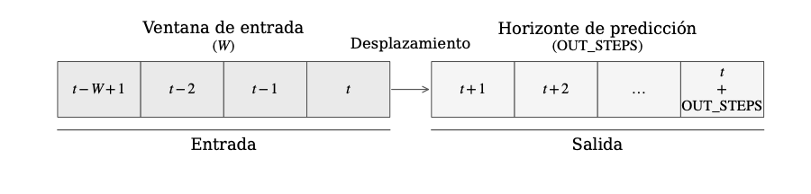

*Figura: Esquema de generación de las ventanas temporales deslizantes.*

Para la configuración de las ventanas se utilizó un desplazamiento igual al horizonte de predicción, de modo que la información de entrada no se superpusiera con los valores futuros a predecir. Esto evitó la fuga de información futura y preservó el orden temporal.

Por otro lado, la longitud de la ventana de entrada se fijó en 168 observaciones, correspondientes a una semana de datos horarios. Esta elección se basó en que los datos presentan patrones temporales asociados a ciclos diarios y semanales. Una ventana de 168 observaciones permitió capturar información temporal relevante para la predicción sin extender excesivamente la entrada, evitando un aumento innecesario del costo computacional.

#### Configuración del entrenamiento

El entrenamiento de todos los modelos se realizó utilizando una cantidad máxima fija de épocas y un criterio de parada temprana basado en la pérdida del conjunto de validación, con el fin de evitar el sobreajuste.

El número máximo de épocas se fijó en 200, permitiendo a los modelos alcanzar la convergencia durante el entrenamiento. El criterio de parada temprana se definió en 10 épocas, de forma de detener el entrenamiento cuando la pérdida de validación dejara de mejorar de manera sostenida.

El tamaño de lote se fijó en 32 observaciones y se mantuvo constante en todos los entrenamientos para asegurar comparabilidad entre modelos. Este valor permitió obtener estabilidad en el entrenamiento con un costo computacional adecuado.

Además, se utilizó el optimizador Adam por su capacidad de ajustar la tasa de aprendizaje de manera individual para cada parámetro durante el entrenamiento. También se evaluaron otros optimizadores, como el descenso de gradiente estocástico, pero no se observaron mejoras en la convergencia ni en el desempeño, por lo que no fueron utilizados en la etapa de búsqueda de hiperparámetros.

## Selección de hiperparámetros

En este capítulo se resume el procedimiento utilizado para la selección de los hiperparámetros de los modelos predictivos y los resultados obtenidos.

### Estrategia de búsqueda

La selección de hiperparámetros se realizó en dos etapas: una etapa inicial de ajuste manual y una etapa posterior de búsqueda automática. Este enfoque permitió comprender el comportamiento de los modelos frente a distintas configuraciones y luego explorar el espacio de hiperparámetros de manera sistemática y reproducible.

En la primera etapa se realizó un ajuste manual teniendo en cuenta el error de entrenamiento y de validación. Este análisis permitió estudiar la relación entre los hiperparámetros, la capacidad del modelo y su impacto tanto en el error de entrenamiento como en el error de generalización. Algunos hiperparámetros influyen en la capacidad del modelo para representar relaciones complejas, como el número de unidades ocultas. Los hiperparámetros de regularización, como el coeficiente l2 y el uso de dropout, permiten controlar el sobreajuste. Otros hiperparámetros, como la tasa de aprendizaje, están asociados al proceso de optimización. Este último es especialmente importante, ya que valores grandes pueden impedir la convergencia, mientras que valores pequeños pueden generar entrenamientos demasiado lentos o soluciones subóptimas.

Aunque el ajuste manual permitió identificar configuraciones razonables y descartar valores inadecuados, se trata de un enfoque limitado. Para explorar de manera sistemática un espacio de hiperparámetros con múltiples dimensiones y relaciones complejas, se adoptó una estrategia de búsqueda aleatoria. Este tipo de búsqueda ha demostrado ser más eficiente que la búsqueda en grilla cuando se considera el número de evaluaciones necesarias para alcanzar configuraciones adecuadas. La búsqueda aleatoria permite que cada experimento utilice una configuración completamente distinta, evitando repetir ensayos similares.

La búsqueda aleatoria se implementó mediante múltiples ejecuciones independientes, denominadas *trials*. Cada *trial* consistió en el entrenamiento completo del modelo con una configuración de hiperparámetros muestreada aleatoriamente, seguido de su evaluación sobre el conjunto de validación.

El perceptrón multicapa fue utilizado como modelo base, por lo que no se realizó una búsqueda de hiperparámetros para esta arquitectura. Su objetivo fue proporcionar una referencia simple frente a la cual comparar el desempeño de modelos más complejos, y no maximizar su rendimiento predictivo.

### Espacio de hiperparámetros

El espacio de hiperparámetros fue definido considerando los parámetros analizados en la etapa manual y aquellos con mayor influencia en la capacidad del modelo, la regularización y la optimización. Para cada modelo se seleccionó un conjunto de hiperparámetros que mantuviera un equilibrio entre la exploración del espacio de configuraciones y el costo computacional del entrenamiento.

Algunos hiperparámetros tienen valores continuos, por lo que se utilizó un esquema basado en distribuciones continuas en escala logarítmica. Este enfoque permitió explorar de manera más efectiva distintos órdenes de magnitud evitando discretizar parámetros continuos.

La tasa de aprendizaje no se utilizó directamente, sino que se muestreó su logaritmo en base 10 de forma uniforme y luego se transformó al espacio original. El mismo procedimiento se aplicó al coeficiente de regularización l2. Este esquema permitió asignar igual importancia a distintos órdenes de magnitud del parámetro.

El número de unidades ocultas y la tasa de dropout toman valores discretos, por lo que fueron muestreados a partir de conjuntos finitos predefinidos. Esta elección responde a que estos parámetros producen cambios discretos en la capacidad del modelo y en el esquema de regularización, resultando suficiente evaluar un conjunto reducido de configuraciones representativas.

Cada configuración de hiperparámetros fue definida como un *trial* independiente que abarcó el entrenamiento del modelo y su evaluación sobre el conjunto de validación. El desempeño obtenido se utilizó para comparar configuraciones y seleccionar los valores finales de los hiperparámetros para cada arquitectura. La  resume los tipos de hiperparámetros considerados durante la búsqueda.

<figure class="thesis-table" id="tbl-espacio-hiperparametros">
  <table class="thesis-table__table">
    <thead>
      <tr class="header-row">
        <th>Hiperparámetro</th>
        <th>Descripción</th>
      </tr>
    </thead>
    <tbody>
      <tr>
        <td>Tasa de aprendizaje</td>
        <td>Tasa de aprendizaje del optimizador</td>
      </tr>
      <tr>
        <td>Regularización &ell;2</td>
        <td>Penalización sobre los pesos del modelo</td>
      </tr>
      <tr>
        <td>Capacidad del modelo</td>
        <td>Número de unidades ocultas</td>
      </tr>
      <tr>
        <td>Dropout</td>
        <td>Regularización por desactivación</td>
      </tr>
    </tbody>
  </table>
  <figcaption>Espacio de hiperparámetros considerado.</figcaption>
</figure>

### Resultados de la selección de hiperparámetros

Para seleccionar las configuraciones más adecuadas del modelo temporal y del modelo espacio-temporal se realizaron 20 ejecuciones y se eligieron los valores de hiperparámetros que minimizaron la función de pérdida en el conjunto de validación.

#### Modelo LSTM

Para LSTM se realizó una búsqueda aleatoria del número de unidades de las capas LSTM, la tasa de aprendizaje, el coeficiente de regularización l2 y la tasa de dropout, siguiendo los valores y distribuciones presentados en .

<figure class="thesis-table" id="tbl-lstm-espacio">
  <table class="thesis-table__table">
    <thead>
      <tr class="header-row">
        <th>Hiperparámetro</th>
        <th>Distribución / Valores</th>
      </tr>
    </thead>
    <tbody>
      <tr>
        <td>Tasa de aprendizaje</td>
        <td>log10(lr) ~ U(-4, -3)</td>
      </tr>
      <tr>
        <td>&ell;2</td>
        <td>log10(&lambda;) ~ U(-6, -3)</td>
      </tr>
      <tr>
        <td>Unidades codificador y decodificador</td>
        <td>{32, 64, 128}</td>
      </tr>
      <tr>
        <td>Dropout</td>
        <td>{0.0, 0.2, 0.3}</td>
      </tr>
    </tbody>
  </table>
  <figcaption>Valores de hiperparámetros considerados para el modelo LSTM.</figcaption>
</figure>

La búsqueda de hiperparámetros se realizó para los horizontes de predicción de una y 24 horas, con el objetivo de analizar el comportamiento del modelo en predicciones inmediatas y evaluar las configuraciones óptimas cuando se requiere predecir varias horas en el futuro.

Los resultados obtenidos en ambas configuraciones, resumidos en , fueron similares, lo que sugiere que la configuración de LSTM es relativamente estable independientemente de la cantidad de horas a predecir. La capacidad del modelo fue la misma en ambas configuraciones. En cambio, la tasa de aprendizaje y el coeficiente de regularización fueron menores para horizontes más lejanos, aunque dentro del mismo orden de magnitud. Dado que la generalización del modelo se evaluó principalmente en horizontes largos, se adoptó como configuración final la obtenida para el horizonte de 24 horas.

<figure class="thesis-table" id="tbl-lstm-seleccion">
  <table class="thesis-table__table">
    <thead>
      <tr class="group-row">
        <th rowspan="2">Hiperparámetro</th>
        <th colspan="2" class="group-head">Horizonte de predicción</th>
      </tr>
      <tr class="header-row">
        <th>OUT_STEPS = 1</th>
        <th>OUT_STEPS = 24</th>
      </tr>
    </thead>
    <tbody>
      <tr>
        <td>Unidades LSTM</td>
        <td>64</td>
        <td>64</td>
      </tr>
      <tr>
        <td>Tasa de aprendizaje</td>
        <td>1.53 &times; 10-4</td>
        <td>1.43 &times; 10-4</td>
      </tr>
      <tr>
        <td>&ell;2</td>
        <td>8.18 &times; 10-6</td>
        <td>1.49 &times; 10-6</td>
      </tr>
      <tr>
        <td>Dropout</td>
        <td>0.0</td>
        <td>0.0</td>
      </tr>
    </tbody>
  </table>
  <figcaption>Hiperparámetros seleccionados para LSTM en los horizontes de predicción.</figcaption>
</figure>

#### Modelo GCN-LSTM

Para GCN-LSTM se exploraron mediante búsqueda aleatoria distintos valores para la cantidad de unidades ocultas de las capas LSTM del codificador y del decodificador, la tasa de aprendizaje, el coeficiente de regularización l2, la tasa de dropout aplicada al bloque GCN y el número de unidades ocultas de la capa GCN. Los valores evaluados se presentan en .

<figure class="thesis-table" id="tbl-gcn-espacio">
  <table class="thesis-table__table">
    <thead>
      <tr class="header-row">
        <th>Hiperparámetro</th>
        <th>Distribución / Valores</th>
      </tr>
    </thead>
    <tbody>
      <tr>
        <td>Tasa de aprendizaje</td>
        <td>log10(lr) ~ U(-4, -3)</td>
      </tr>
      <tr>
        <td>&ell;2</td>
        <td>log10(&lambda;) ~ U(-6, -3)</td>
      </tr>
      <tr>
        <td>Unidades GCN</td>
        <td>{32, 64, 128}</td>
      </tr>
      <tr>
        <td>Unidades LSTM</td>
        <td>{32, 64, 128}</td>
      </tr>
      <tr>
        <td>Dropout GCN</td>
        <td>{0.0, 0.2, 0.3}</td>
      </tr>
    </tbody>
  </table>
  <figcaption>Valores de hiperparámetros considerados para el modelo GCN-LSTM.</figcaption>
</figure>

El modelo espacio-temporal se entrenó sobre grafos específicos para cada contaminante. Para cada contaminante se construyó un subgrafo con las estaciones que lo miden. Sin embargo, la selección de hiperparámetros se realizó de manera conjunta para todos los contaminantes objetivo. Para cada configuración de la búsqueda aleatoria se entrenaron modelos independientes utilizando los respectivos subgrafos, manteniendo la misma configuración de hiperparámetros. Cada configuración se evaluó a partir del error de validación promedio sobre todos los contaminantes, buscando una selección final generalizable y no optimizada únicamente para un contaminante particular.

Al igual que para LSTM, la búsqueda aleatoria se ejecutó para ambos horizontes de predicción. Los resultados finales se resumen en  y mostraron una configuración estable entre horizontes.

<figure class="thesis-table" id="tbl-gcn-seleccion">
  <table class="thesis-table__table">
    <thead>
      <tr class="group-row">
        <th rowspan="2">Hiperparámetro</th>
        <th colspan="2" class="group-head">Horizonte de predicción</th>
      </tr>
      <tr class="header-row">
        <th>OUT_STEPS = 1</th>
        <th>OUT_STEPS = 24</th>
      </tr>
    </thead>
    <tbody>
      <tr>
        <td>Tasa de aprendizaje</td>
        <td>6.43 &times; 10-4</td>
        <td>1.57 &times; 10-4</td>
      </tr>
      <tr>
        <td>Coeficiente &ell;2</td>
        <td>8.20 &times; 10-6</td>
        <td>1.37 &times; 10-6</td>
      </tr>
      <tr>
        <td>Unidades GCN</td>
        <td>64</td>
        <td>64</td>
      </tr>
      <tr>
        <td>Unidades LSTM</td>
        <td>64</td>
        <td>64</td>
      </tr>
      <tr>
        <td>Dropout GCN</td>
        <td>0.0</td>
        <td>0.0</td>
      </tr>
    </tbody>
  </table>
  <figcaption>Hiperparámetros seleccionados para GCN-LSTM en los horizontes de predicción.</figcaption>
</figure>

## Esquema de evaluación

Para evaluar los diferentes modelos implementados se aplicaron dos esquemas complementarios: un *hold-out* temporal y un esquema de validación cruzada temporal.

En el esquema *hold-out*, el conjunto de datos completo se dividió respetando el orden cronológico de la serie, utilizando el 70 % de los datos para entrenamiento, el 20 % para validación y el 10 % restante para prueba. Con este enfoque, el conjunto de prueba corresponde al período más reciente disponible y permite comparar directamente las distintas arquitecturas utilizando todos los datos.

Para el esquema de validación cruzada temporal se utilizaron tres particiones consecutivas, cada una con 18 meses de entrenamiento, 6 meses de validación y 6 meses de prueba. Este enfoque permite analizar la estabilidad del modelo en diferentes períodos de la serie.

En la primera partición, el período de entrenamiento abarcó desde el 01/06/2021 hasta el 23/11/2022, la validación desde el 23/11/2022 hasta el 22/05/2023 y la prueba desde el 22/05/2023 hasta el 18/11/2023.

En la segunda partición, el entrenamiento se realizó entre el 27/01/2022 y el 21/07/2023, la validación entre el 21/07/2023 y el 17/01/2024, y la prueba entre el 17/01/2024 y el 15/07/2024.

En la tercera partición, el entrenamiento se extendió desde el 24/09/2022 hasta el 17/03/2024, la validación desde el 17/03/2024 hasta el 13/09/2024 y la prueba desde el 13/09/2024 hasta el 31/12/2024.

Este enfoque siguió el orden cronológico de los datos, evitando la filtración de información futura y permitiendo la evaluación en distintos intervalos temporales. Los resultados finales se reportan como el promedio de la métrica obtenida en las tres particiones.

Se utilizaron distintas métricas para analizar el comportamiento de los modelos. En primer lugar, el error absoluto medio (MAE), que mide el error promedio en las predicciones. También se consideró el error cuadrático medio (RMSE), que penaliza más los errores de gran magnitud y resulta útil para entender el comportamiento del modelo frente a picos de concentración.

Además, para el esquema de *hold-out* temporal se calcularon métricas específicas para el horizonte de predicción t+k: MAEt+k y RMSEt+k. Estas métricas permiten evaluar el error asociado al último paso del horizonte, diferenciándolo del error promedio sobre toda la secuencia de salida. En el caso de predicción a una hora hacia adelante, las métricas asociadas al último paso coinciden con las métricas del error promedio.

Para el análisis de las predicciones se seleccionó la estación 8 como caso representativo, ya que corresponde a una estación urbana de tráfico y cuenta con mediciones de los tres contaminantes objetivo. Esta estación permite analizar el comportamiento de los modelos en un entorno urbano influenciado por múltiples fuentes de emisión.

## Análisis de resultados

En este capítulo también se resumen los resultados obtenidos para las diferentes arquitecturas implementadas.

### Modelo Perceptrón multicapa

El perceptrón multicapa actuó como línea base y se utilizó para definir una referencia de desempeño frente a las arquitecturas temporales y espacio-temporales más complejas.

  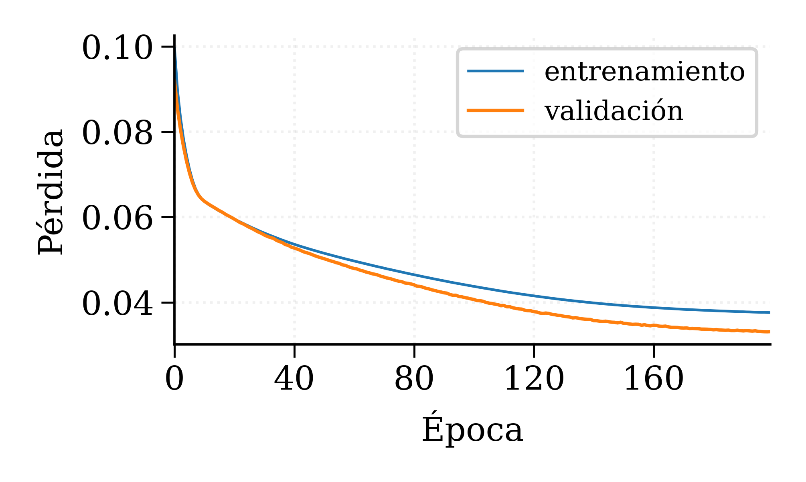
  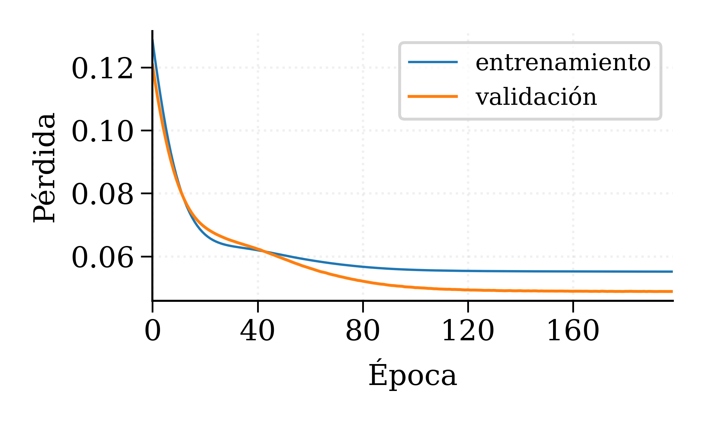

*Figura: Convergencia de la función de pérdida del modelo MLP en la estación urbana de tráfico Escuelas Aguirre.*

La pérdida de entrenamiento y de validación mostró comportamientos distintos según el horizonte. En el horizonte de una hora la pérdida disminuyó progresivamente, mientras que en el horizonte de 24 horas la disminución fue más abrupta. En ambos casos, las curvas de entrenamiento y validación permanecieron cercanas, indicando que no hubo un sobreajuste significativo. Las métricas obtenidas para este modelo se presentan en .

<figure class="thesis-table" id="tbl-mlp-holdout">
  <table class="thesis-table__table">
    <thead>
      <tr class="group-row">
        <th rowspan="2">Contaminante</th>
        <th colspan="2" class="group-head">1 h</th>
        <th colspan="4" class="group-head">24 h</th>
      </tr>
      <tr class="header-row">
        <th>MAE</th>
        <th>RMSE</th>
        <th>MAE</th>
        <th>MAEt+24</th>
        <th>RMSE</th>
        <th>RMSEt+24</th>
      </tr>
    </thead>
    <tbody>
      <tr>
        <td>PM2.5</td>
        <td>6.30</td>
        <td>7.59</td>
        <td>6.78</td>
        <td>6.89</td>
        <td>8.06</td>
        <td>8.03</td>
      </tr>
      <tr>
        <td>NO2</td>
        <td>12.87</td>
        <td>15.97</td>
        <td>16.94</td>
        <td>16.22</td>
        <td>21.45</td>
        <td>21.60</td>
      </tr>
      <tr>
        <td>O3</td>
        <td>8.71</td>
        <td>10.90</td>
        <td>22.93</td>
        <td>23.05</td>
        <td>26.72</td>
        <td>26.56</td>
      </tr>
    </tbody>
  </table>
  <figcaption>MAE y RMSE del modelo MLP para horizontes de una y 24 horas en la estación Escuelas Aguirre (&micro;g/m3).</figcaption>
</figure>

Los errores obtenidos deben interpretarse en relación con la magnitud y la variabilidad de los contaminantes. En PM2.5, la serie presenta alta variabilidad temporal y picos abruptos de contaminación. Para el horizonte de una hora, el MAE fue elevado en comparación con la variabilidad de la serie, indicando que el MLP tuvo dificultades para capturar su dinámica temporal. El RMSE fue mayor que el MAE, lo que sugiere la presencia de errores puntuales de gran magnitud asociados a picos que el modelo no logró anticipar.

Para NO2 y O3 el comportamiento fue similar. En ambos casos, los errores para el horizonte de una hora fueron elevados respecto a los niveles característicos de cada contaminante. En NO2 la diferencia entre RMSE y MAE fue más notoria, mientras que en O3, aunque el error fue alto, la diferencia entre ambas métricas fue menor, indicando menos errores extremos que en PM2.5 y NO2.

En el horizonte de 24 horas, los valores de MAE y RMSE fueron similares para todos los contaminantes. Además, los valores de MAE y MAEt+24, así como RMSE y RMSEt+24, fueron cercanos entre sí, indicando que el error no se incrementó al final del horizonte. Esto sugiere que el MLP generó predicciones suavizadas y cercanas al valor medio.

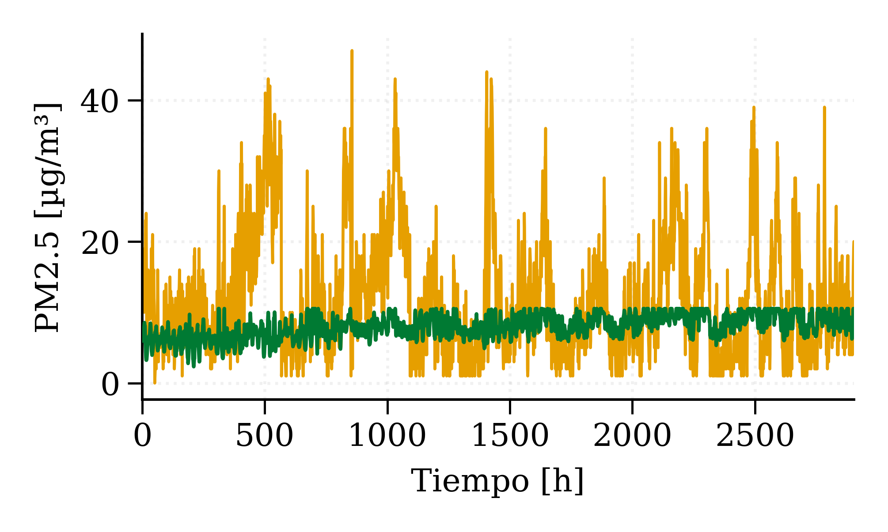
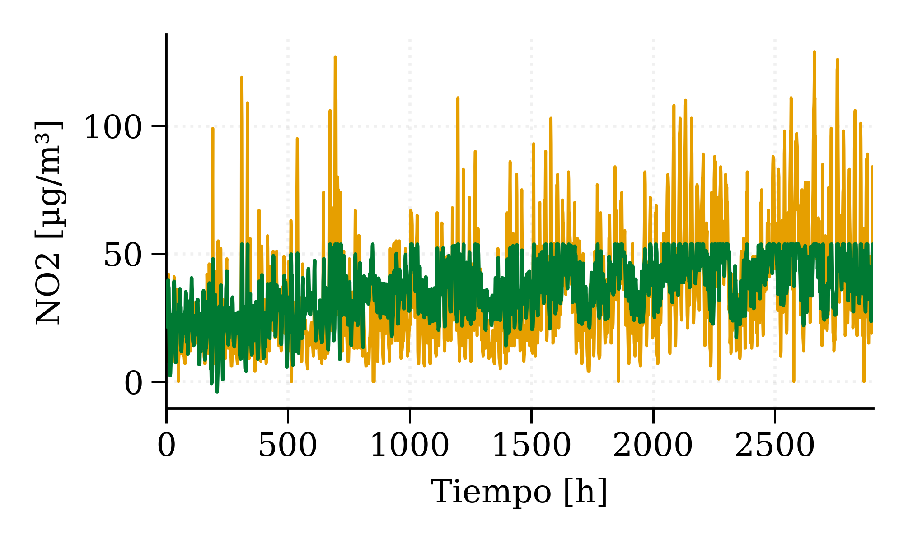
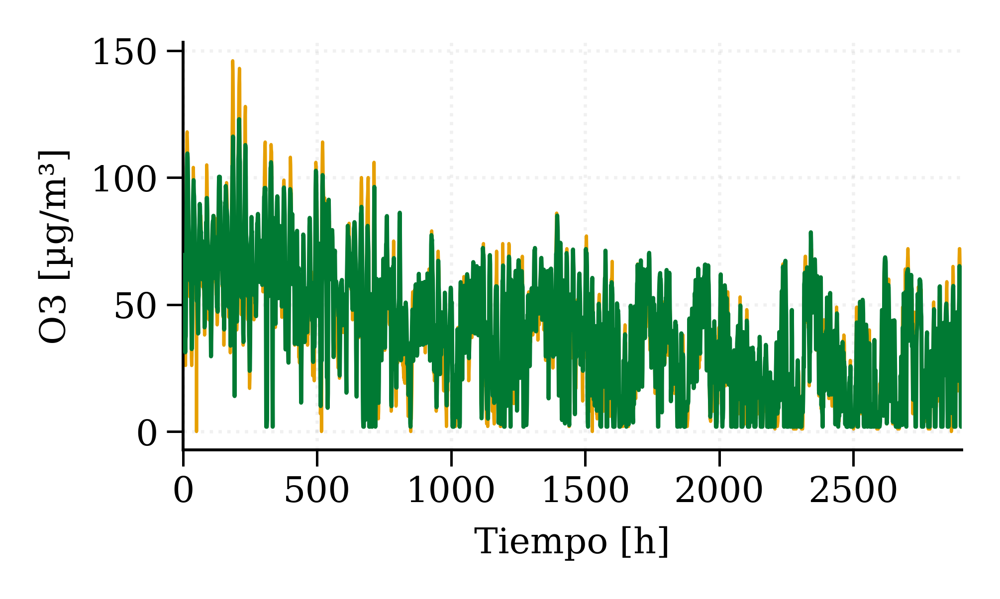

*Figura: Predicciones a una hora del modelo MLP en la estación urbana de tráfico Escuelas Aguirre.*

En los tres contaminantes, el modelo predijo valores suavizados cercanos al valor medio de cada serie y con menor variación que los valores reales observados. En el caso de O3, la predicción siguió algo mejor la tendencia general de la serie, aunque no logró capturar completamente los picos de concentración.

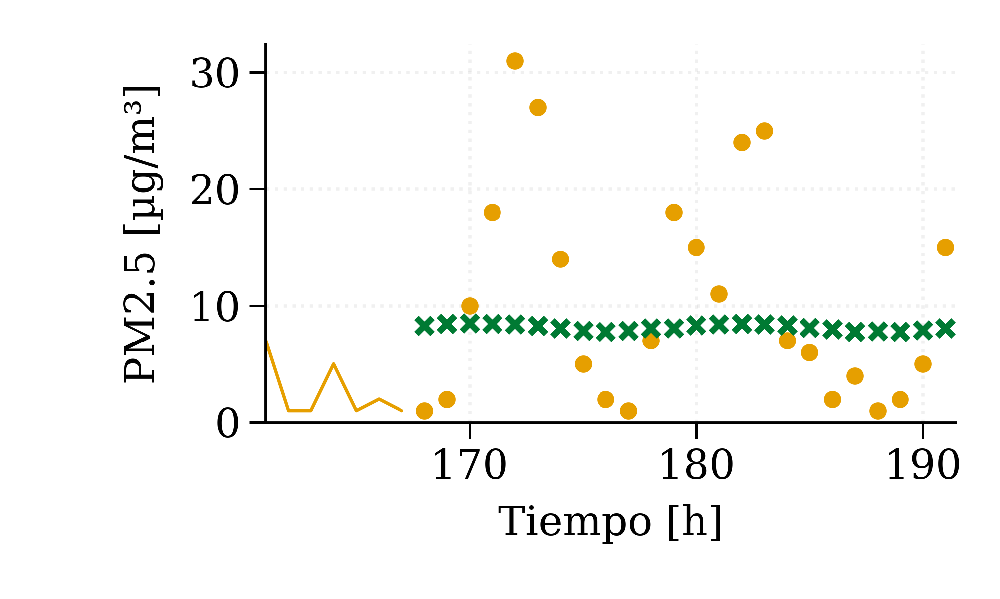
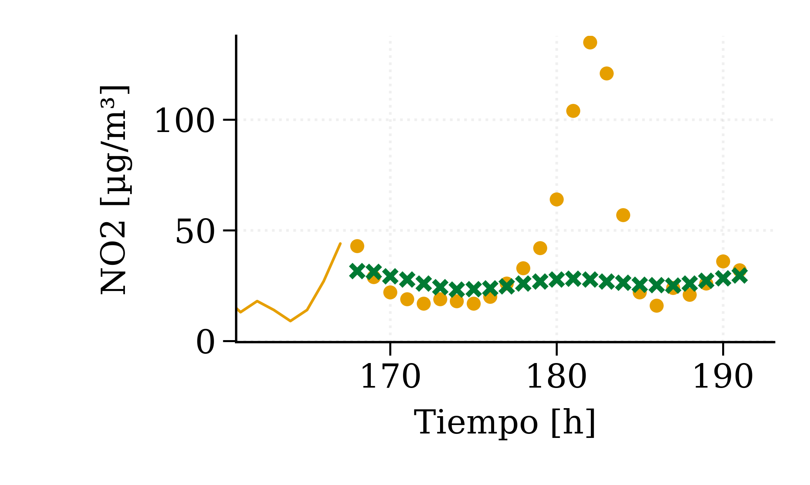
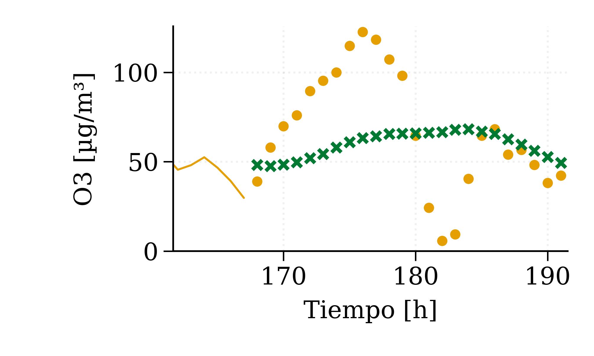

*Figura: Predicciones a 24 horas del modelo MLP en la estación urbana de tráfico Escuelas Aguirre.*

Como se observa en estas predicciones, el comportamiento del MLP a 24 horas fue similar al del horizonte corto: las predicciones resultaron suavizadas y cercanas al valor medio, subestimando los picos y sin reproducir adecuadamente la amplitud de los valores reales.

### Modelo LSTM codificador-decodificador

La evaluación del modelo LSTM codificador-decodificador consistió también en realizar el esquema de *hold-out* temporal para los horizontes de una y 24 horas. El modelo es multivariado, por lo que predijo simultáneamente las concentraciones de NO2, O3 y PM2.5.

  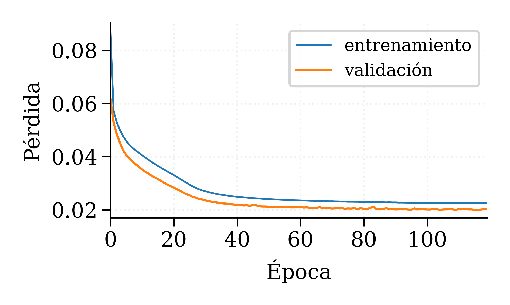
  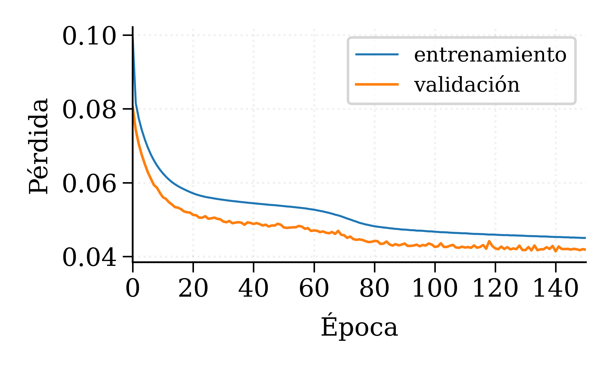

*Figura: Convergencia de la función de pérdida del modelo LSTM en la estación urbana de tráfico Escuelas Aguirre.*

Para ambos horizontes de predicción, la pérdida disminuyó de forma consistente tanto en entrenamiento como en validación. Las curvas descendieron hasta alcanzar una zona estable y con poca separación entre sí, lo que indica que el modelo aprendió sin perder capacidad de generalización. La convergencia fue más lenta en el horizonte de 24 horas, reflejando la mayor complejidad del problema cuando aumenta la cantidad de pasos futuros a predecir. Las métricas obtenidas para LSTM se resumen en .

<figure class="thesis-table" id="tbl-lstm-holdout">
  <table class="thesis-table__table">
    <thead>
      <tr class="group-row">
        <th rowspan="2">Contaminante</th>
        <th colspan="2" class="group-head">1 h</th>
        <th colspan="4" class="group-head">24 h</th>
      </tr>
      <tr class="header-row">
        <th>MAE</th>
        <th>RMSE</th>
        <th>MAE</th>
        <th>MAEt+24</th>
        <th>RMSE</th>
        <th>RMSEt+24</th>
      </tr>
    </thead>
    <tbody>
      <tr>
        <td>PM2.5</td>
        <td>2.81</td>
        <td>3.62</td>
        <td>5.31</td>
        <td>6.03</td>
        <td>6.50</td>
        <td>7.05</td>
      </tr>
      <tr>
        <td>NO2</td>
        <td>5.47</td>
        <td>7.80</td>
        <td>11.89</td>
        <td>12.90</td>
        <td>15.60</td>
        <td>16.52</td>
      </tr>
      <tr>
        <td>O3</td>
        <td>4.94</td>
        <td>6.80</td>
        <td>12.38</td>
        <td>13.83</td>
        <td>15.21</td>
        <td>16.57</td>
      </tr>
    </tbody>
  </table>
  <figcaption>MAE y RMSE del modelo LSTM codificador-decodificador para horizontes de una y 24 horas en la estación Escuelas Aguirre (&micro;g/m3).</figcaption>
</figure>

En comparación con el MLP, LSTM redujo los errores para todos los contaminantes y en ambos horizontes de predicción. Para el horizonte de una hora, los errores fueron menores que la variabilidad de las series, lo que demuestra la capacidad del modelo para capturar dependencias temporales de corto plazo. En términos de MAE, la reducción fue de aproximadamente 55 % para PM2.5, 57 % para NO2 y 43 % para O3.

En PM2.5, el modelo siguió de cerca la tendencia de la serie, capturando incrementos y descensos, aunque todavía presentó dificultades para anticipar exactamente los picos de concentración y las caídas abruptas. En NO2 se observó un comportamiento consistente, con errores menores respecto al modelo base y una mayor capacidad para seguir las variaciones de la serie. En O3, las predicciones de LSTM se acercaron con mayor precisión a los valores reales, superando claramente al MLP.

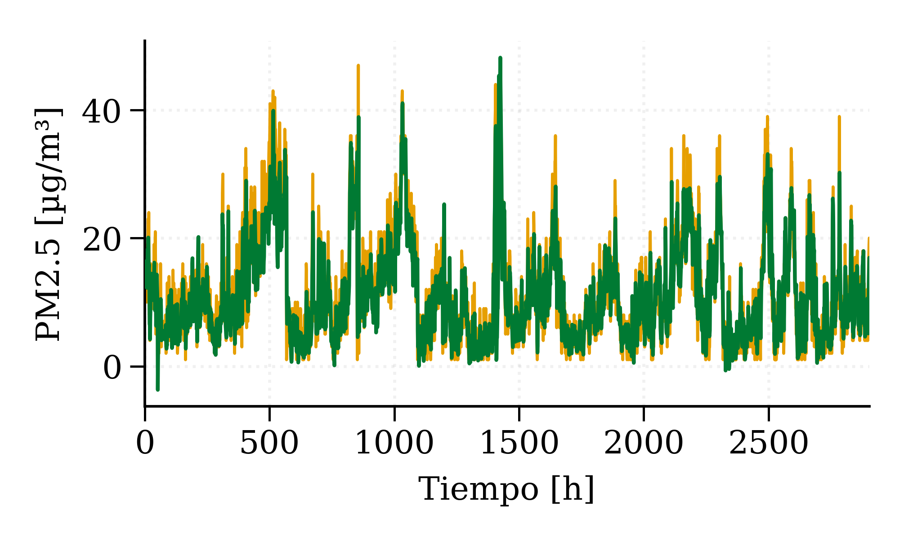
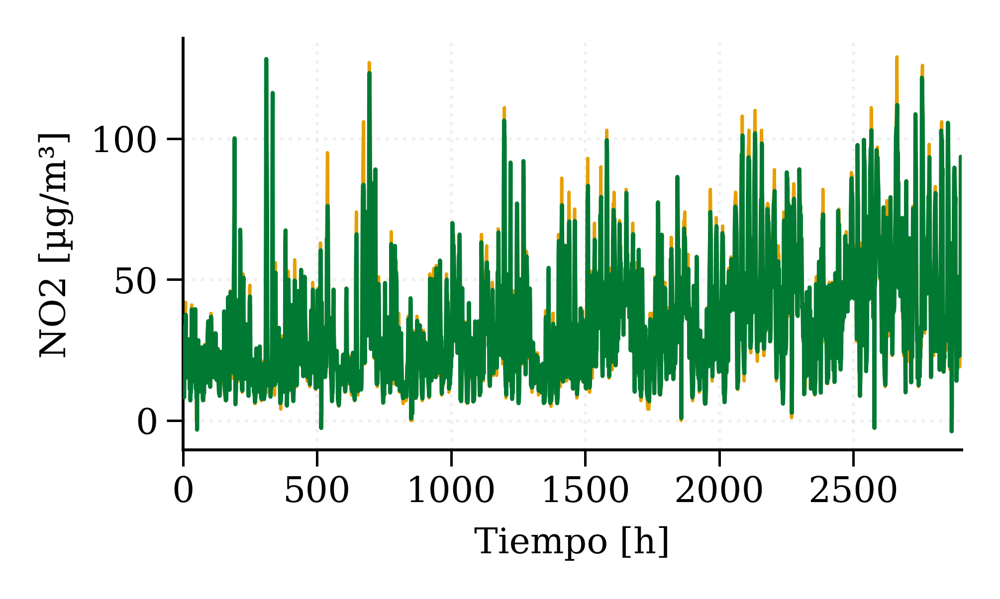
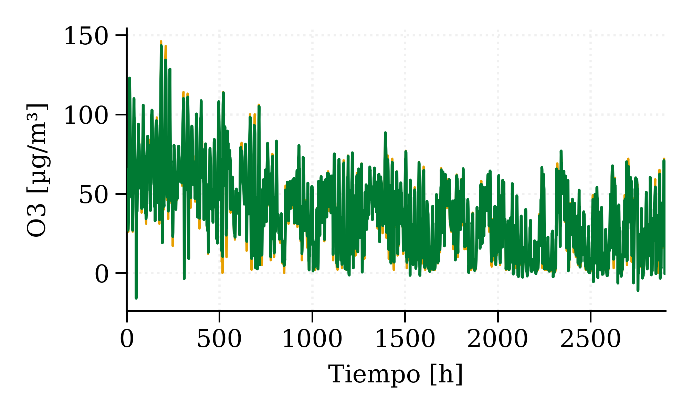

*Figura: Predicciones a una hora del modelo LSTM codificador-decodificador en la estación urbana de tráfico Escuelas Aguirre.*

En el horizonte de 24 horas, tanto MAE como RMSE aumentaron para todos los contaminantes, reflejando una degradación del desempeño cuando crece la cantidad de pasos a predecir. Aun así, los errores se mantuvieron por debajo de los obtenidos por el modelo base. Los valores de MAEt+24 y RMSEt+24 fueron mayores que los errores promedio de 24 horas, y la diferencia entre estas métricas fue superior a la observada en el MLP. Esto indica que LSTM sí incorpora la dimensión temporal en sus predicciones y que el error aumenta conforme se predice más lejos en el futuro.

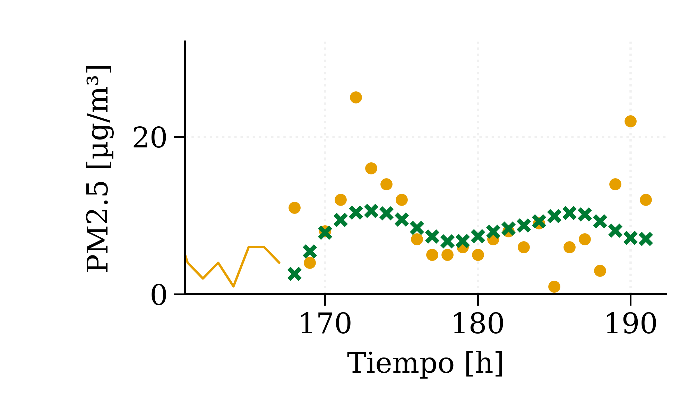
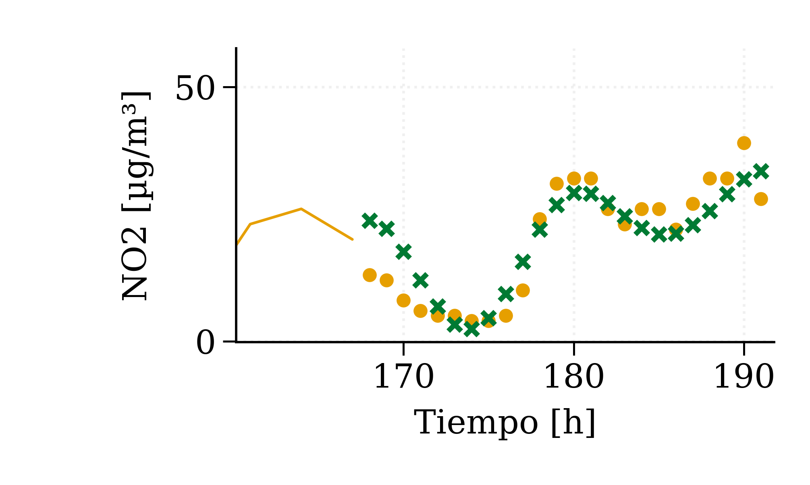
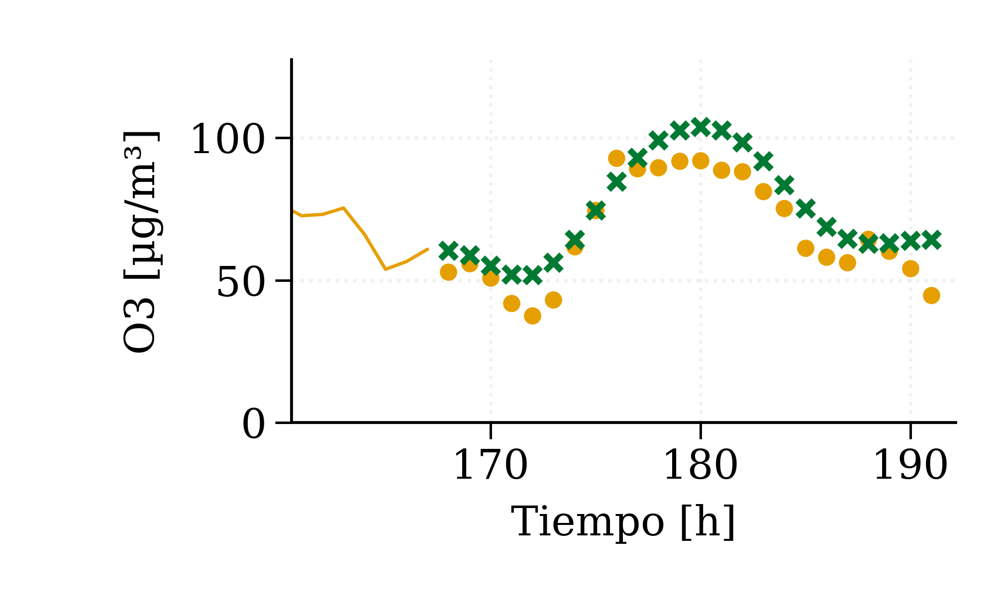

*Figura: Predicciones a 24 horas del modelo LSTM codificador-decodificador en la estación urbana de tráfico Escuelas Aguirre.*

En este horizonte, el modelo siguió la tendencia general de las series. En PM2.5, suavizó parte de las variaciones abruptas. En NO2, logró capturar la dinámica general y también los extremos del tramo analizado, aunque con una leve subestimación del pico máximo. Para O3, el comportamiento fue similar: siguió la tendencia de la serie, incluyendo cambios abruptos, y reprodujo el máximo y el posterior descenso.

### Modelo GCN-LSTM codificador-decodificador

El modelo más complejo incorporó la dimensión espacial de los datos mediante la construcción de subgrafos específicos para cada contaminante, entrenando un modelo independiente por cada uno. Como consecuencia, se obtuvieron curvas de pérdida diferentes para cada contaminante objetivo.

  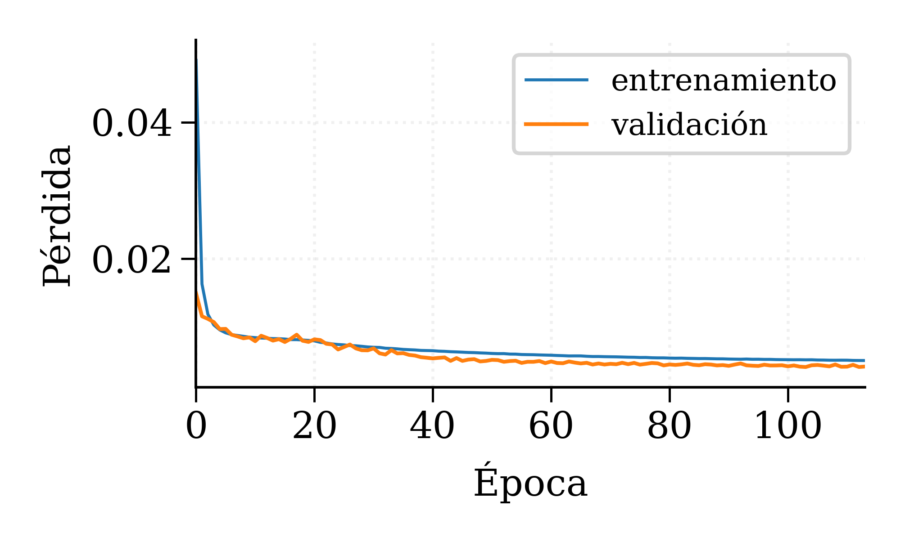
  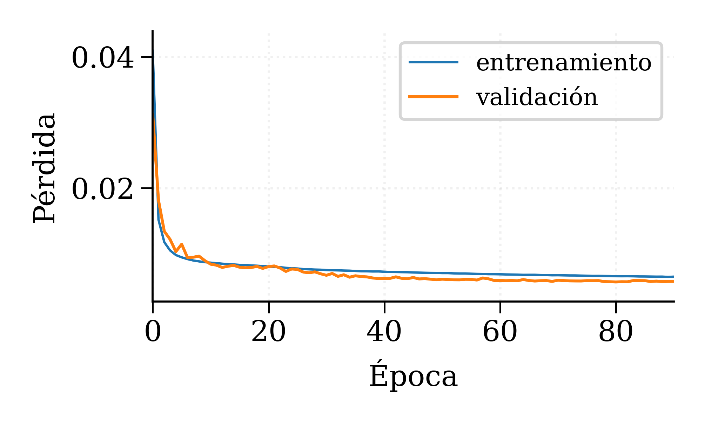

*Figura: Convergencia de la función de pérdida del modelo GCN-LSTM en la estación urbana de tráfico Escuelas Aguirre para PM2.5.*

En las primeras épocas la pérdida disminuyó y luego se estabilizó. Se observó equilibrio entre los errores de entrenamiento y validación, lo que sugiere que el modelo generalizó correctamente sin sobreajustar. Las métricas correspondientes se presentan en .

<figure class="thesis-table" id="tbl-gcn-holdout">
  <table class="thesis-table__table">
    <thead>
      <tr class="group-row">
        <th rowspan="2">Contaminante</th>
        <th colspan="2" class="group-head">1 h</th>
        <th colspan="4" class="group-head">24 h</th>
      </tr>
      <tr class="header-row">
        <th>MAE</th>
        <th>RMSE</th>
        <th>MAE</th>
        <th>MAEt+24</th>
        <th>RMSE</th>
        <th>RMSEt+24</th>
      </tr>
    </thead>
    <tbody>
      <tr>
        <td>PM2.5</td>
        <td>3.36</td>
        <td>4.09</td>
        <td>4.77</td>
        <td>5.19</td>
        <td>6.05</td>
        <td>6.40</td>
      </tr>
      <tr>
        <td>NO2</td>
        <td>6.26</td>
        <td>8.92</td>
        <td>10.94</td>
        <td>11.87</td>
        <td>15.75</td>
        <td>16.76</td>
      </tr>
      <tr>
        <td>O3</td>
        <td>6.05</td>
        <td>8.16</td>
        <td>11.58</td>
        <td>12.20</td>
        <td>13.99</td>
        <td>15.62</td>
      </tr>
    </tbody>
  </table>
  <figcaption>MAE y RMSE del modelo GCN-LSTM codificador-decodificador para horizontes de una y 24 horas en la estación Escuelas Aguirre (&micro;g/m3).</figcaption>
</figure>

En todos los casos, GCN-LSTM superó al modelo base y redujo el error entre 25 % y 50 % dependiendo del contaminante y del horizonte de predicción.

En comparación con LSTM, GCN-LSTM no obtuvo mejoras en el horizonte de una hora en términos de MAE y RMSE. Este resultado puede explicarse porque las concentraciones futuras de los contaminantes dependen fuertemente del estado inmediato de la serie. En esta situación, las relaciones espaciales no agregan información útil para la predicción a corto plazo y el patrón temporal es suficiente para capturar la dinámica presente en los datos.

Por el contrario, en el horizonte de 24 horas el modelo espacio-temporal presentó mejoras de hasta 22 % respecto a LSTM. Este comportamiento sugiere que, a medida que aumenta el horizonte de predicción, los valores futuros dependen no solo del estado inmediato, sino también de condiciones meteorológicas acumuladas, transporte de contaminantes y otros procesos de carácter acumulativo. En este caso, la estructura espacial aporta información relevante.

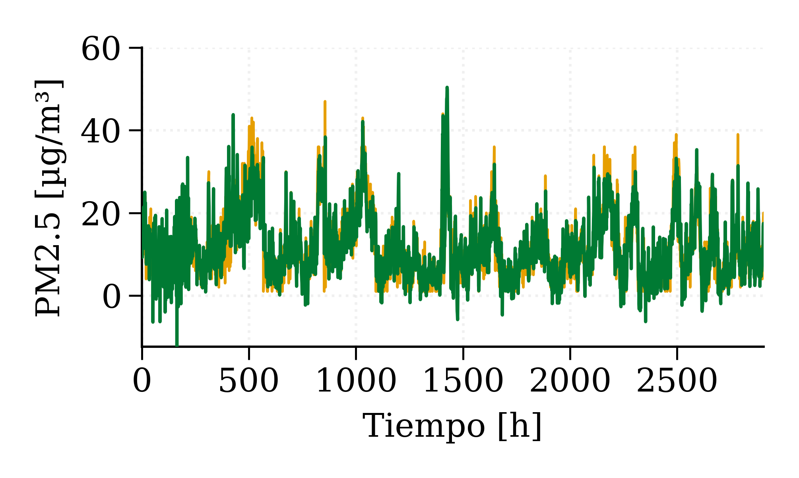
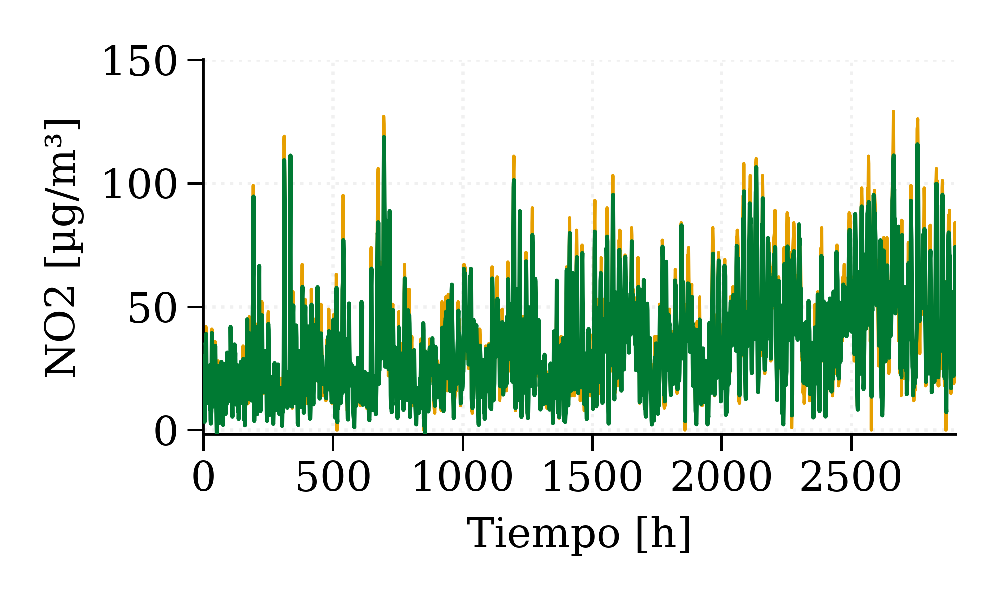
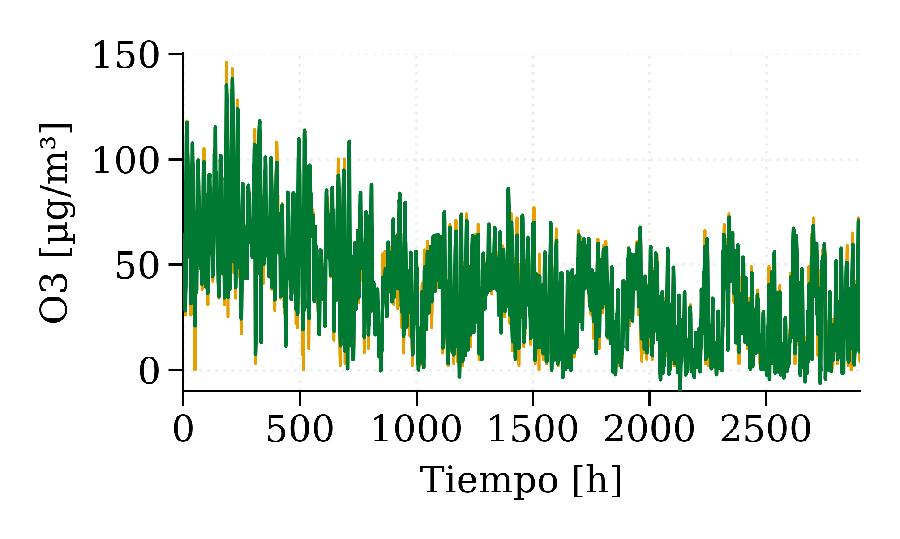

*Figura: Predicciones a una hora del modelo GCN-LSTM codificador-decodificador en la estación urbana de tráfico Escuelas Aguirre.*

En las predicciones a una hora, el modelo siguió de cerca los valores reales y logró representar picos de contaminación y descensos, aunque suavizando los valores altos. En O3, la diferencia con el modelo base no fue tan grande, por lo que el aporte temporal y espacial resulta menos notorio en las gráficas.

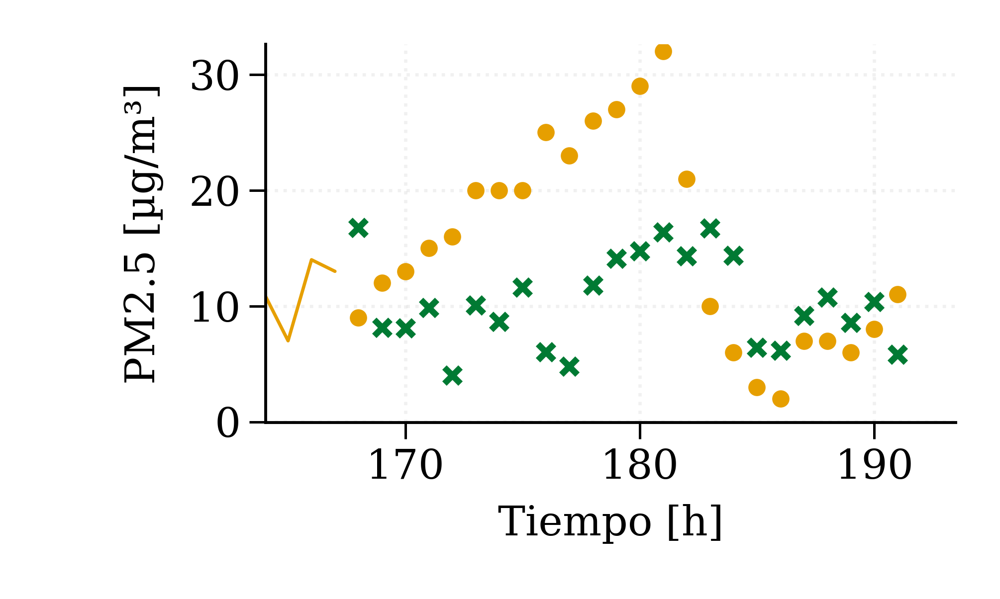
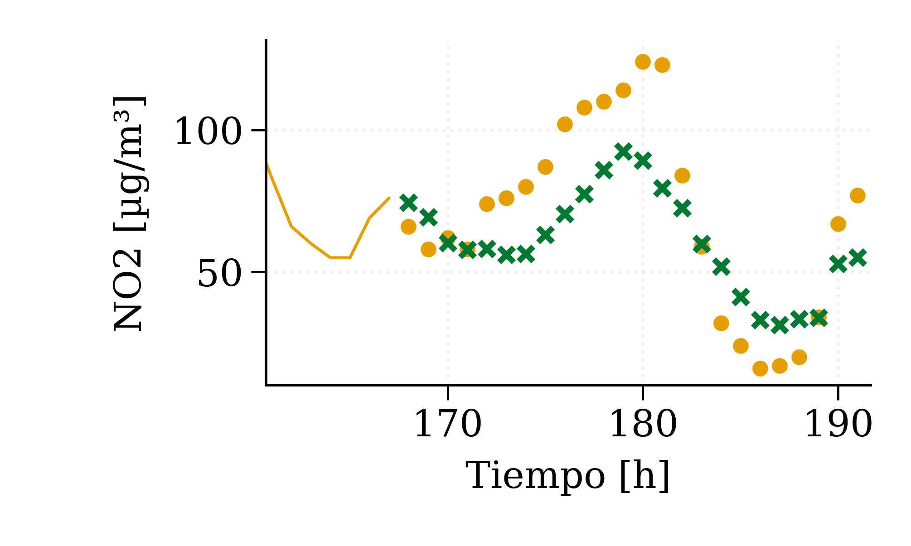
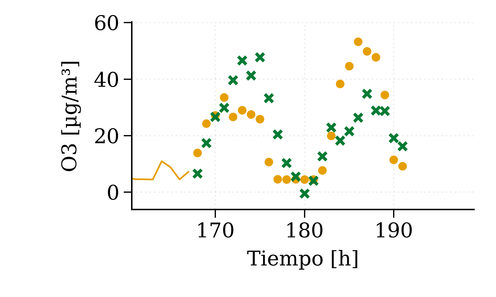

*Figura: Predicciones a 24 horas del modelo GCN-LSTM codificador-decodificador en la estación urbana de tráfico Escuelas Aguirre.*

En el horizonte de 24 horas, el modelo logró capturar la tendencia general de las series temporales, aunque en todos los contaminantes se observó una subestimación de los picos máximos.

### Validación cruzada temporal

Para analizar la estabilidad de los modelos y la variación del error en diferentes períodos de entrenamiento y prueba, se utilizaron las particiones temporales definidas previamente. Los resultados fueron consistentes con los obtenidos en el esquema de *hold-out* temporal.

En las predicciones de corto y largo plazo, los modelos secuenciales superaron al modelo base en los tres contaminantes. Las arquitecturas recurrentes lograron capturar la dinámica temporal de manera más efectiva. LSTM obtuvo los menores errores en el horizonte de una hora en términos de MAE y RMSE. Aunque los errores obtenidos por el modelo espacio-temporal no fueron muy superiores, los resultados sugieren que la información espacial no tuvo un impacto fuerte en la mejora de las predicciones a corto plazo.

En cuanto a la estabilidad, LSTM y GCN-LSTM presentaron un desempeño similar en distintos períodos evaluados. Las menores desviaciones estándar indican que los modelos no dependen de un período específico y muestran una mejor capacidad de generalización. Por el contrario, el perceptrón multicapa presentó alta desviación en las mediciones de todos los contaminantes, indicando que su desempeño depende fuertemente del período de evaluación utilizado.

En el horizonte de 24 horas, el comportamiento fue distinto. Los modelos secuenciales siguieron superando al modelo base, pero en este caso el componente espacial mostró mejoras. GCN-LSTM obtuvo los menores valores de MAE y RMSE en PM2.5 y O3. En NO2, LSTM alcanzó un RMSE apenas menor, pero GCN-LSTM presentó una desviación estándar inferior, indicando mayor estabilidad temporal. Estos resultados sugieren que la incorporación de información espacial fue útil a medida que aumentó el horizonte de predicción. Los resultados promedio de validación cruzada para ambos horizontes se muestran en  y .

<figure class="thesis-table" id="tbl-cv-1h">
  <table class="thesis-table__table">
    <thead>
      <tr class="group-row">
        <th rowspan="2">Modelo</th>
        <th colspan="2" class="group-head">PM2.5</th>
        <th colspan="2" class="group-head">NO2</th>
        <th colspan="2" class="group-head">O3</th>
      </tr>
      <tr class="header-row">
        <th>MAE</th>
        <th>RMSE</th>
        <th>MAE</th>
        <th>RMSE</th>
        <th>MAE</th>
        <th>RMSE</th>
      </tr>
    </thead>
    <tbody>
      <tr>
        <td>MLP</td>
        <td>7.88 &plusmn; 4.21</td>
        <td>9.72 &plusmn; 5.59</td>
        <td>10.41 &plusmn; 1.26</td>
        <td>13.20 &plusmn; 1.27</td>
        <td>13.48 &plusmn; 5.89</td>
        <td>16.69 &plusmn; 6.97</td>
      </tr>
      <tr>
        <td>LSTM</td>
        <td>4.37 &plusmn; 0.86</td>
        <td>4.78 &plusmn; 1.60</td>
        <td>5.92 &plusmn; 0.53</td>
        <td>8.33 &plusmn; 0.77</td>
        <td>6.30 &plusmn; 0.78</td>
        <td>8.50 &plusmn; 1.02</td>
      </tr>
      <tr>
        <td>GCN-LSTM</td>
        <td>5.05 &plusmn; 1.47</td>
        <td>5.68 &plusmn; 1.01</td>
        <td>6.33 &plusmn; 0.62</td>
        <td>8.93 &plusmn; 0.75</td>
        <td>7.61 &plusmn; 2.17</td>
        <td>8.52 &plusmn; 1.73</td>
      </tr>
    </tbody>
  </table>
  <figcaption>Resultados de la validación cruzada a una hora en la estación Escuelas Aguirre (&micro;g/m3).</figcaption>
</figure>

<figure class="thesis-table" id="tbl-cv-24h">
  <table class="thesis-table__table">
    <thead>
      <tr class="group-row">
        <th rowspan="2">Modelo</th>
        <th colspan="2" class="group-head">PM2.5</th>
        <th colspan="2" class="group-head">NO2</th>
        <th colspan="2" class="group-head">O3</th>
      </tr>
      <tr class="header-row">
        <th>MAE</th>
        <th>RMSE</th>
        <th>MAE</th>
        <th>RMSE</th>
        <th>MAE</th>
        <th>RMSE</th>
      </tr>
    </thead>
    <tbody>
      <tr>
        <td>MLP</td>
        <td>6.48 &plusmn; 0.74</td>
        <td>8.17 &plusmn; 1.30</td>
        <td>15.43 &plusmn; 0.96</td>
        <td>19.61 &plusmn; 1.27</td>
        <td>21.17 &plusmn; 4.79</td>
        <td>25.24 &plusmn; 5.51</td>
      </tr>
      <tr>
        <td>LSTM</td>
        <td>5.53 &plusmn; 1.27</td>
        <td>7.13 &plusmn; 1.87</td>
        <td>13.24 &plusmn; 2.09</td>
        <td>17.30 &plusmn; 2.75</td>
        <td>15.03 &plusmn; 1.90</td>
        <td>18.51 &plusmn; 2.09</td>
      </tr>
      <tr>
        <td>GCN-LSTM</td>
        <td>4.80 &plusmn; 1.56</td>
        <td>6.98 &plusmn; 1.19</td>
        <td>13.19 &plusmn; 2.05</td>
        <td>17.71 &plusmn; 1.65</td>
        <td>14.80 &plusmn; 1.18</td>
        <td>17.24 &plusmn; 0.88</td>
      </tr>
    </tbody>
  </table>
  <figcaption>Resultados de la validación cruzada a 24 horas en la estación Escuelas Aguirre (&micro;g/m3).</figcaption>
</figure>

En términos de estabilidad, las desviaciones estándar en el horizonte largo fueron menores para los modelos recurrentes que para el modelo base. Las mejoras obtenidas con GCN-LSTM no se limitaron a un período específico, sino que el comportamiento se repitió en las distintas particiones temporales.
